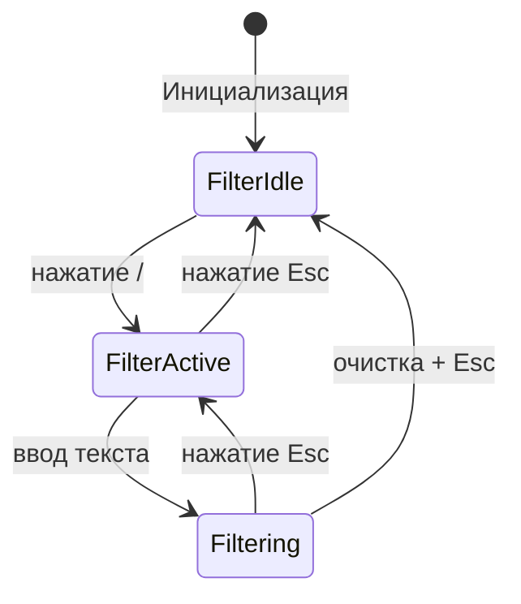
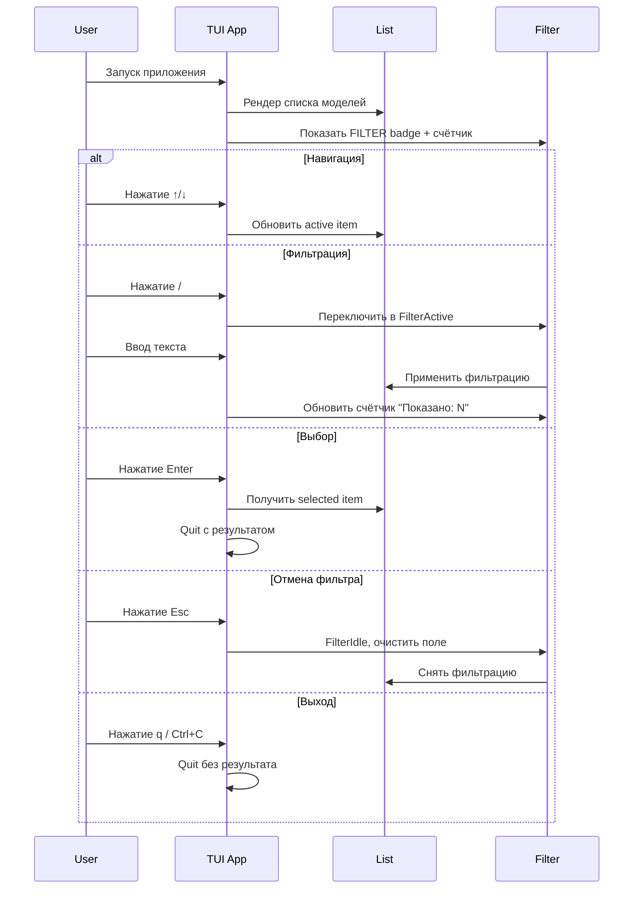

# Схема состава экрана списка моделей — TUI Interface

## 1. Обзор архитектуры экрана

Экран состоит из трёх основных блоков, каждый из которых занимает 100% ширину терминала и имеет padding: `left/right = 20px`, `top/bottom = 10px`.

```mermaid
block
  columns 1

  Screen["Terminal Screen (100% width)\npadding: left/right=20px\ntop/bottom=10px"]

  block:HeaderSection
    columns 8
    VersionBadge["v0.1.0\n(бейдж версии)"]:2
    Title["llama-server-loader - Model Selector"]:6
  end

  block:ContentSection
    columns 1
    FilterArea["[FILTER] или поле ввода фильтра"]
    CountLabel["Показано: N / Всего: M"]
    ListContainer["List Container\n(рамка, фон отличный от основного)"]
  end

  block:FooterSection
    columns 1
    FooterContent["↑↓ навигация │ Enter выбор │ / фильтр │ q выход"]
  end

  Screen --> HeaderSection
  Screen --> ContentSection
  Screen --> FooterSection

  classDef screen fill:#0a0f18,stroke:#4ade80;
  classDef listContainer fill:#0a0f18,stroke:#4ade80;
  classDef footer fill:#050a12,stroke:#34d399;

  class Screen screen;
  class ListContainer listContainer;
  class FooterSection footer;
```



## 2. Детальная схема каждого блока

### Блок 1: Header (Шапка)

```
┌──────────────────────────────────────────────────────────────┐
│ [v0.1.0]          llama-server-loader - Model Selector      │
└──────────────────────────────────────────────────────────────┘
 padding-left: 20px    padding-right: 20px
 padding-top: 10px     padding-bottom: 10px
```

| Элемент | Описание | Стиль |
|---------|----------|-------|
| `VersionBadge` | Бейдж версии приложения, берётся из переменной сборки (`-ldflags -X main.version=...`) | Фон: `GreenBright (#4ade80)`, Текст: `GreenDark (#064e3b)`, Bold, padding: 2px 8px |
| `Title` | Заголовок экрана — "llama-server-loader - Model Selector" | Font-size: крупный, Bold, Foreground: `TextPrimary (#ffffff)` |

**Расположение:** VersionBadge и Title в одном row, растянуты на 100% ширины. Badge слева, Title занимает оставшееся пространство.

---

### Блок 2: Main Content (Основной контент)

```
┌──────────────────────────────────────────────────────────────┐
│ [FILTER]                                                     │
│ Показано: 3 / Всего: 15                                      │
│ ┌──────────────────────────────────────────────────────────┐ │
│ │ llama-3.2-3b-instruct-q4_k_m.gguf                        │ │
│ │   D:\models\llama-3.2-3b-instruct-q4_k_m.gguf            │ │
│ │   [4.5GB]  [Q4_K_M]  [mmproj]                            │ │
│ ├──────────────────────────────────────────────────────────┤ │
│ │ llama-3.1-8b-instruct-q4_k_m.gguf                        │ │
│ │   D:\models\llama-3.1-8b-instruct-q4_k_m.gguf            │ │
│ │   [15.2GB]  [Q4_K_M]                                     │ │
│ └──────────────────────────────────────────────────────────┘ │
└──────────────────────────────────────────────────────────────┘
```

#### Подблоки:

| Элемент | Описание | Поведение |
|---------|----------|-----------|
| `FilterBadge` | Статичный бейдж с текстом "FILTER" | Видим по умолчанию, стиль как VersionBadge |
| `FilterInput` | Поле ввода текста для фильтрации | Появляется вместо FilterBadge при нажатии `/`, скрывается при Esc |
| `CountLabel` | Лейбл счётчика моделей | Формат: "Показано: N / Всего: M", обновляется динамически при фильтрации |
| `ListContainer` | Контейнер списка с рамкой и отличным фоном | Занимает оставшееся пространство, собственная вертикальная прокрутка |

#### Элемент списка модели (Model Item):

```
│ llama-3.2-3b-instruct-q4_k_m.gguf                        │ ← строка 1: имя модели с расширением (bold, TextPrimary)
│   ...D:\models\llama-3.2...q4_k_m.gguf                   │ ← строка 2: полный путь с truncation слева (приглушённый цвет)
│   [4.5GB]  [mmproj]  [Q4_K_M]  [...]                     │ ← строка 3: бейджи метаданных (фон + рамка)
```

| Поле | Описание | Стиль |
|------|----------|-------|
| `ModelID` | Имя модели с расширением (например `llama-3.2-3b-instruct-q4_k_m.gguf`) | Bold, `TextPrimary (#ffffff)`, строка 1 |
| `ModelPath` | Полный путь к файлу с truncation **слева** (обрезается начало пути, конец виден) | `TextSecondary (#e2e8f0)` приглушённый, отступ слева 4 символа, строка 2 |
| `SizeBadge` | Размер файла (например `[4.5GB]`) | Фон отличный от элемента (`DarkBg`), рамка `GreenBright`, текст `GreenPrimary` |
| `MMProjBadge` | Пометка наличия mmproj файлa (если есть) | Фон отличный от элемента, рамка `GreenPrimary`, текст `GreenPrimary` |
| `QuantizationBadge` | Квантование — заглушка `[Q4_K_M]` | Фон отличный от элемента, рамка `TextSecondary`, текст `TextSecondary`, MVP1 заглушка |
| `PlaceholderBadge` | Заглушка для будущего расширения (MVP2+) | Пустой бейдж с рамкой, показывает что есть место для расширений |

**Отступ между элементами:** 4px (рекомендация UI/UX — оптимальное визуальное разделение без избыточного пустого пространства)

**Высота элемента:** Фиксированная — ровно 3 строки терминала.

**Активный элемент (focused):**
- Левый бордер (`border-left`) с **неоновым эффектом**: цвет `GreenBright (#4ade80)`, толщина 2 символа, с лёгким glow/blur эффектом через lipgloss `Shadow()` если поддерживается терминалом
- Имя модели (`ModelID`) — Bold + `TextPrimary` (белый на тёмном фоне)
- Остальные строки — без изменений (путь и бейджи сохраняют стиль)

**Неоновый эффект бордера:** Реализация через lipgloss shadow для терминального glow:
```go
func (s *StyleConfig) ItemActiveBorderStyle() lipgloss.Style {
    return lipgloss.NewStyle().
        Border(lipgloss.NormalBorder(), false, false, false, true).
        BorderForeground(lipgloss.Color(s.GreenBright)).
        Shadow(true).           // Glow эффект слева
        ShadowColor(lipgloss.Color(s.GreenBright)).
        Padding(0, 0, 0, 1)
}
```

Если терминал не поддерживает ANSI shadow (некоторые терминалы ограничены), fallback — чистый бордер без glow.

---

### Блок 3: Footer (Подвал)

```
┌──────────────────────────────────────────────────────────────┐
│ ↑↓ навигация │ Enter выбор │ / фильтр │ q выход             │
└──────────────────────────────────────────────────────────────┘
```

| Элемент | Описание | Стиль |
|---------|----------|-------|
| `QuickHelp` | Контейнер подсказок клавиш | Рамка (border), фон отличный от основного (`DarkBg`), padding: 10px |

**Структура подсказок:** Каждый элемент подсказки — это пара "клавиша + описание", разделённые вертикальной чертой или пробелом.

| Подсказка | Формат | Описание |
|-----------|--------|----------|
| Навигация | `↑↓ навигация` | Стрелки вверх/вниз для перемещения по списку |
| Выбор | `Enter выбор` | Enter для выбора модели и выхода из TUI |
| Фильтр | `/ фильтр` | Нажатие / активирует режим фильтрации |
| Выход | `q выход` | q или Ctrl+C для выхода |

**Архитектурное требование:** Подсказки статичные, но структура должна позволять добавлять дополнительные row подсказок в будущем (через композицию компонентов).

---

## 3. Состояния фильтрации



| Состояние | Отображение в Header-зоне фильтра | Поведение списка |
|-----------|-----------------------------------|------------------|
| `FilterIdle` | Бейдж `[FILTER]` | Показывает все модели |
| `FilterActive` | Поле ввода с курсором | Показывает все модели, ожидает ввод |
| `Filtering` | Поле ввода с текстом | Фильтрация по введённому тексту (case-insensitive) |

---

## 4. UI/UX рекомендации (на основе Skill UI/UX Designer)

### 4.1 Визуальная иерархия

- **Первичный фокус:** Имя файла модели — самый крупный и жирный элемент
- **Вторичная информация:** Путь к файлу — меньший размер шрифта, secondary цвет
- **Третичная информация:** Бейджи метаданных — компактные, с рамками

### 4.2 Доступность (WCAG AA)

Все цветовые пары соответствуют WCAG AA контрастности:
- `TextPrimary (#ffffff)` на `DarkBg (#0a0f18)` → контраст **16.2:1** (AAA)
- `TextSecondary (#e2e8f0)` на `DarkBg (#0a0f18)` → контраст **13.8:1** (AAA)
- `GreenBright (#4ade80)` на `DarkBg (#0a0f18)` → контраст **5.2:1** (AA)

### 4.3 Навигация с клавиатуры

Полная поддержка keyboard-first навигации:
- `↑` / `↓` — перемещение по списку
- `Enter` — выбор и выход
- `/` — активация фильтрации
- `Esc` — отмена фильтрации + очистка
- `q` / `Ctrl+C` — выход из приложения

### 4.4 Состояния элементов списка

| Состояние | Описание | Визуальное отображение |
|-----------|----------|------------------------|
| Normal | Обычный элемент | Фон: DarkBg, текст: TextPrimary/TextSecondary |
| Active (hover) | Выбранный стрелками | Левый бордер GreenBright, Bold имя файла |
| Selected | Подтверждён Enter | Выход из TUI с сохранением выбора |

---

## 5. Структура Go компонентов

```
internal/cli/
├── cli.go              # Main App struct, Update, View
├── styles.go           # StyleConfig с методами для каждого блока
├── model_item.go       # ListItem с новым форматом отображения (3 строки)
├── filter.go           # FilterState management, toggle logic
├── footer.go           # QuickHelp rendering, extensible row system
└── dimensions.go       # Min/Max width constraints, responsive layout
```

### 5.1 App struct (обновлённый)

```go
type App struct {
    list         list.Model
    selected     *modelscan.Model
    filterState  FilterState      // Idle / Active / Filtering
    filterText   string
    countShown   int              // Показано моделей
    countTotal   int              // Всего моделей
    title        string
    version      string           // Версия из переменной сборки
    width        int
    height       int
    styles       *StyleConfig
    minListWidth int              // Минимальная ширина списка
    maxListWidth int              // Максимальная ширина списка
}
```

### 5.2 FilterState enum

```go
type FilterState int
const (
    FilterIdle FilterState = iota
    FilterActive
    Filtering
)
```

### 5.3 ListItem (обновлённый) — 3-строчный формат

```go
type ListItem struct {
    model *modelscan.Model
}

func (l ListItem) RenderLines() []string {
    return []string{
        l.model.Name,                                    // строка 1: имя
        "  " + l.model.Path,                             // строка 2: путь с отступом
        formatMetadataBadges(l.model),                   // строка 3: бейджи
    }
}

func formatMetadataBadges(m *modelscan.Model) string {
    badges := []string{formatSizeBadge(m.Size)}       // [4.5GB]
    badges = append(badges, "[Q4_K_M]")               // заглушка квантования
    if len(m.MMProjPaths) > 0 {
        badges = append(badges, "[mmproj]")
    }
    return strings.Join(badges, " ")
}
```

### 5.4 Footer — расширяемая система подсказок

```go
type HelpRow struct {
    Keys      string // "↑↓"
    Label     string // "навигация"
}

type Footer struct {
    rows []HelpRow
}

func (f *Footer) AddRow(keys, label string) {
    f.rows = append(f.rows, HelpRow{keys, label})
}

func (f *Footer) Render() string {
    // Рендер всех row в контейнере с рамкой
}
```

---

## 6. Responsive layout — min/max width

| Параметр | Значение по умолчанию | Описание |
|----------|-----------------------|----------|
| `minListWidth` | 40 символов | Минимальная ширина списка до горизонтального скролла |
| `maxListWidth` | 120 символов | Максимальная ширина списка, дальше растягивается на всю ширину |

При `width < minListWidth`: список сжимается, текст переносится.
При `width > maxListWidth`: список занимает 100% ширины (padding сохраняется).

---

## 7. Цветовая схема (из styles.go)

| Токен | HEX | Использование |
|-------|-----|---------------|
| `GreenDark` | `#064e3b` | Текст на зелёном фоне |
| `GreenPrimary` | `#34d399` | CTA, mmproj badge, активные элементы |
| `GreenBright` | `#4ade80` | Границы, бейджи метаданных, active бордер |
| `TextPrimary` | `#ffffff` | Основной текст (имя файла) |
| `TextSecondary` | `#e2e8f0` | Вторичный текст (путь, квантование) |
| `DarkBg` | `#0a0f18` | Фон интерфейса |

---

## 8. Flow диаграмма взаимодействия пользователя



